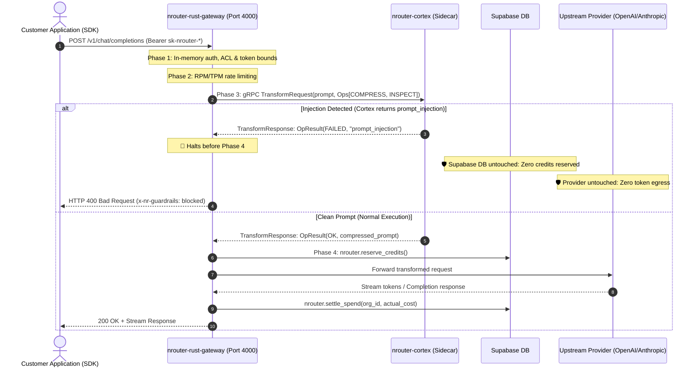

# CLAUDE.md — nrouter-sdk

Ten SDKs for the nRouter gateway, and the gate that keeps them speaking one
contract. **The only PUBLIC repo in the workspace** — everything committed here
is world-readable. Treat every file as published.

## Client Architecture & Gateway Interaction Flow

All ten SDKs connect to the Rust gateway (`api.nrouter.ai/v1/*`). The gateway coordinates preflight validation, credit reservations in Supabase DB, content evaluation via Cortex, and upstream provider calls.



## All Ten SDKs Supported

**Ten SDKs exist here; all ten are supported.** All ten SDKs adhere to the identical gateway wire contract, share coordinated release version **`3.1.2`**, and stay subject to the same conformance gate.

| SDK | Registry / Distribution | Package | Version |
|---|---|---|---|
| `sdks/js` | npm | `@nrouter_ai/sdk` | 3.1.2 |
| `sdks/python` | PyPI | `nrouter-sdk` | 3.1.2 |
| `sdks/java` | Maven Central | `ai.nrouter:nrouter-sdk` | 3.1.2 |
| `sdks/kotlin` | Maven Central | `ai.nrouter:nrouter-sdk-kotlin` | 3.1.2 |
| `sdks/android` | Maven Central | `ai.nrouter:nrouter-sdk-android` | 3.1.2 |
| `sdks/go` | Go Modules (`proxy.golang.org`) | `github.com/nRouterGateway/nrouter-sdk/sdks/go/v3` | 3.1.2 |
| `sdks/rust` | crates.io | `nrouter` | 3.1.2 |
| `sdks/swift` | Swift Package Manager | `github.com/nRouterGateway/nrouter-sdk` | 3.1.2 |
| `sdks/dart` | pub.dev | `nrouter` | 3.1.2 |
| `sdks/r` | R-universe / CRAN | `nrouter` | 3.1.2 |

### Distribution Mechanisms

- **Tag-distributed** — `sdks/go` via `proxy.golang.org` on the `sdks/go/vN.N.N`
  tag; `sdks/swift` via SPM on the repo tag.
- **Preview registry** — `sdks/r` at `https://nroutergateway.r-universe.dev/nrouter`
  as package `nrouter`, built from the `release-r` branch that `publish-r.yml`
  pushes.
- **Registry-published, unsupported** — `sdks/rust` on crates.io as `nrouter`,
  `sdks/dart` on pub.dev as `nrouter`. Both carry the coordinated version.
  Publication is not a support commitment.
- **Maven Central previews** — `sdks/{kotlin,android}` publish to Maven Central via
  GitHub Actions under coordinated version `3.1.2`.
  `test_sdk_version_3_android_cannot_publish_ahead_of_its_kotlin_core` enforces that
  Android cannot publish ahead of its Kotlin core on Central.

⚠️ **rust and dart publish from a maintainer's credentials, not from CI.**
`publish-rust.yml` and `publish-dart.yml` run verification; registry publication
is done with maintainer credentials under coordinated release `3.1.2`.

**A `publish-*` filename is not evidence a workflow publishes** — `publish-rust.yml`
and `publish-dart.yml` run verification only, and `publish-kotlin.yml` /
`publish-android.yml` declare `name: verify-kotlin` / `verify-android`. Grep the
job for the actual publish command before believing it.

Derive the live versions; never quote one from prose:

```bash
curl -s https://registry.npmjs.org/@nrouter_ai%2Fsdk | python3 -c "import sys,json;print(json.load(sys.stdin)['dist-tags']['latest'])"
curl -s https://pypi.org/pypi/nrouter-sdk/json  | python3 -c "import sys,json;print(json.load(sys.stdin)['info']['version'])"
curl -s https://repo1.maven.org/maven2/ai/nrouter/nrouter-sdk/maven-metadata.xml | grep -oE '<release>[^<]+</release>'
```

**This narrows what is supported, NOT what must stay correct.** All ten SDKs
still run in `conformance/check_conformance.py`, and a contract change still has
to land in all ten — a spec edit that leaves seven behind turns a green gate
into a lie the day one of them is supported. Source tags do not broaden the
support commitment.

⚠️ **The ten SDKs carry ONE release version IN SOURCE; what each registry serves
is a separate question.** `spec/nrouter-sdk-spec.json` is canonical and the
conformance gate checks every manifest, lockfile and Swift/Go version marker, so
a breaking change advances the coordinated version for all ten in this tree. It
does not follow that every registry holds that version — the source-only four do
not publish at all, and every registry is immutable, so a published artifact is
never corrected in place. Read the version from the registry, never from source.

### Release Automation & Guidance

Release guidance is owned privately in `nrouter-infra-cicd` because this repository is public:
- Dedicated skill: [`deploy-nrouter-sdk`](../nrouter-infra-cicd/skills/deploy-nrouter-sdk/SKILL.md)
- Dedicated command: [`/deploy-nrouter-sdk`](../nrouter-infra-cicd/commands/deploy-nrouter-sdk.md)
- In-repo release notes: [`PUBLISHING.md`](PUBLISHING.md)

Never create, move, or copy internal release runbooks into `nrouter-sdk/skills/` (it is world-readable).

Independent repo, own remote, nested in `nrouter-brain`, gitignored by it.
**Edit in place; commit and push here.** Rule #20: `git pull --ff-only` → edit →
focused tests → review → push, never force.
**HTTPS git fails — use SSH (`git@github.com:…`).**

Left `nrouter-ent-ai-hub` on 2026-08-26 with its full history intact
(`git subtree split`, 37 commits, identical tree hash). The old public history is
preserved on the `main-legacy-pre-extraction` branch.

This repo owns no `rules/`, but the workspace rules still bind. Claude Code loads
them automatically; Codex, Gemini CLI and Antigravity do not and must open:

- `~/nr/nrouter-brain/sdlc/rules/00-permanent-rules.md` —
  especially **#14 the SDK is canonical**, #18 scratch, #20 direct-main,
  #28 never a $0 price, #35 brand.
- `~/nr/nrouter-brain/nrouter-rust-gateway/rules/00-gateway-rules.md`
  — the wire contract these SDKs implement. §4f gate 9 is why no provider
  credential or engine name may appear in a customer-visible surface.

## Layout

```
Package.swift        # the SHIPPING Swift manifest — SwiftPM reads the REPO ROOT
spec/                # nrouter-sdk-spec.json — the SoT under Rule #14
conformance/         # the cross-SDK gate; run it before every release
docs/                # validation-playbook-template.md & cross-SDK documentation
skills/              # 1 SDK skill: nrouter-sdk (router) + sub-skills parity, testing, hardening
sdks/{python,js,java,kotlin,android,swift,rust,dart,r,go}/
  ├── demo/          # runnable SDK demonstrations and quickstarts
  └── docs/          # validation-playbook.md for each technology
```

## The one rule that matters here

**`spec/nrouter-sdk-spec.json` is the source of truth, derived from the
gateway** — never the other way round. Base URL, `NROUTER_API_KEY`, the
`sk-nrouter-` prefix, every `x-nr-*` header and nine error codes. When an
SDK and the spec disagree, the SDK is wrong.

```bash
python3 scripts/check_sdk_parity.py --self-test       # prove cross-SDK parity gate bites
python3 scripts/check_sdk_parity.py                   # check demos, playbooks, manifests, READMEs & conformance
python3 conformance/check_conformance.py --self-test # prove the conformance gate bites
python3 conformance/check_conformance.py             # all ten agree on spec
```

Each SDK's own suite proves it is self-consistent; the gate proves they agree
with each other. Neither replaces the other, and `conformance/README.md` states
plainly what the gate cannot catch.

## Traps

- **The gateway's main error path sends NO `code`** — it emits
  `{"error":{"type":"gateway_error","message":…}}`. Classifying on `code` alone
  makes `guardrail_blocked` unreachable. Order: code (when sent) → status →
  message. This shipped broken in five SDKs at once.
- **Unpriced is not free.** `x-nr-request-cost` is ABSENT when unpriced; render
  it as `0` and you report a free request, which no enabled model is (Rule #28).
- **A non-JSON or unparseable 2xx is a BILLED response**, not an empty one.
- **Never print the API key.** Rust's derived `Debug` and any Swift `struct`
  reflect it by default; R's list printer shows it. All five native SDKs redact.
- **Two Swift manifests exist** — the root one ships, `sdks/swift/` is the dev
  loop. Change both; the conformance gate fails if they drift.

## Publishing

Per SDK, in its own `PUBLISHING.md`. Registry status is a fact — query the
registry immediately before a release rather than trusting prose.

⚠️ **This repo is public.** No credentials, no internal hostnames, no customer
data, no engine name (Rule #29). A secret committed here is a secret disclosed.

<!-- BEGIN GENERATED: permanent-rules-pointer (bootstrap.sh) -->

## The Permanent Rules — for Codex, Gemini CLI and Antigravity

You are reading this through `AGENTS.md` or `GEMINI.md`, which symlink to this file.
Claude Code receives the rules below automatically via `@import`; **your harness does
not**. They are mandatory all the same. Read the ones relevant to what you are about to
touch BEFORE editing — each path resolves from your home directory (`~/`).

**They are listed in READING ORDER, not alphabetically.** The first two are the
authority and apply to everything; the rest are path-scoped detail that matters only
when you touch that area. If you read nothing else, read the first one.

- `~/nr/nrouter-brain/sdlc/rules/00-permanent-rules.md`
- `~/nr/nrouter-brain/sdlc/rules/00-workspace-repos.md`
- `~/nr/nrouter-brain/sdlc/rules/10-testing.md`
- `~/nr/nrouter-brain/sdlc/rules/20-tdd-and-fleet.md`
- `~/nr/nrouter-brain/nrouter-app/rules/02-multi-tenancy.md`
- `~/nr/nrouter-brain/nrouter-app/rules/03-credit-safety.md`
- `~/nr/nrouter-brain/nrouter-app/rules/05-frontend-standards.md`
- `~/nr/nrouter-brain/nrouter-app/rules/07-stripe-integration.md`
- `~/nr/nrouter-brain/nrouter-app/rules/11-api-routes.md`
- `~/nr/nrouter-brain/nrouter-app/rules/13-enterprise-features.md`
- `~/nr/nrouter-brain/nrouter-app/rules/17-virtual-keys.md`
- `~/nr/nrouter-brain/nrouter-app/rules/30-email-templates.md`
- `~/nr/nrouter-brain/nrouter-cortex/rules/00-cortex-rules.md`
- `~/nr/nrouter-brain/nrouter-frontend-ui/rules/40-image-blog-standards.md`
- `~/nr/nrouter-brain/nrouter-infra-cicd/rules/08-database.md`
- `~/nr/nrouter-brain/nrouter-infra-cicd/rules/15-startup-health.md`
- `~/nr/nrouter-brain/nrouter-infra-cicd/rules/16-infrastructure.md`
- `~/nr/nrouter-brain/nrouter-manage-company/rules/19-soc2-new-feature-checklist.md`
- `~/nr/nrouter-brain/nrouter-rust-gateway/rules/00-gateway-rules.md`
- `~/nr/nrouter-brain/nrouter-rust-gateway/rules/01-provider-contract.md`

`00-permanent-rules.md` is the authority: it carries the full prose of all
the rules, the Rule→Skill map, and the enforcement map showing which rules
auto-block versus which rely on discipline. Start there if you only read one.

<!-- END GENERATED: permanent-rules-pointer -->
